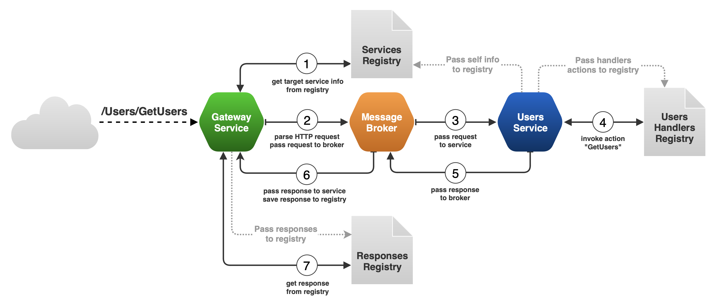

# AlfaMicroserviceMesh

<a name="readme-top"></a>

  <summary></summary>
    <li>
      <a href="#about">About</a>
    </li>
    <li>
      <a href="#what-included">What's included</a>
    </li>
    <li>
      <a href="#environment-requirements">Environment Requirements</a>
    </li>
    <li>
      <a href="#installation">Installation</a>
    </li>
    <li>
      <a href="#create-your-microservice-application">Create your microservice application</a>
      <ul>
        <li><a href="#establish-api-gateway">Establish API Gateway</a></li>
        <li><a href="#add-new-microservice">Add new microservice</a></li>
        <li><a href="#running-application">Running application</a></li>
      </ul>
    <li>
      <a href="#usage">Usage</a>
    </li>

## About


**AlfaMicroserviceMesh** is a microservices framework for [.NET](https://dotnet.microsoft.com/en-us/). It helps you to build efficient, scalable services. Framework provides features for building your microservices.

The diagram below describes how microservices communicate with each other using a message broker.


---

## What's included

- request-reply concept
- built-in service registry & dynamic service discovery
- load balanced requests (Round-robin)
- Fault tolerance features (RetryPolicy, Timeouts)
- built-in caching solution (MemoryCache)
- pluggable loggers (Console, Serilog)
- transport (RabbitMQ)
- serializer (JSON)
- customer parameter validator
- master-less architecture, all nodes are equal
- built-in metrics feature (Prometheus)
- custom API gateway with universal controller

## Environment Requirements

| Requirement     | Description              | Required |
| --------------- | ------------------------ | -------- |
| .NET            | Preferably version 8.0.2 | ✔        |
| RabbitMQ server | As a message broker      | ✔        |
| MySQL server    | As a database            | -        |
| Seq server      | As a logging server      | -        |

## Installation

```sh
dotnet add package AlfaMicroserviceMesh
```

## Create your microservice application

### Establish API Gateway

Create new dotnet **webapi** project using CLI command:

```sh
dotnet new webapi -n <your_gateway_name>
```

Enter variables to `appsettings.js`

```json
{
  "ServiceName": "Your Gateway Name",
  "Version": "Gateway Version",
  "Connections": {
    "RabbitMQ": {
      "Host": "host_name",
      "Port": "port"
    }
  },
  "JWT": {
    "Issuer": "http://your_server:port",
    "Audience": "http://your_api:port",
    "SigningKey": "Your Signing Key" //the key size must be greater than 256 bits
  },
  "Serilog": {
    "Using": [
      "Serilog.Sinks.Console",
      // "Serilog.Sinks.Seq" - if you want to use Seq
    ],
    "MinimumLevel": {
      "Default": "Information",
      "Override": {
        "Microsoft": "Information"
      }
    },
    "WriteTo": [
      { "Name": "Console" },
      /* {
       "Name": "Seq",
       "Args": { "serverUrl": "http://seq_server:port"}
      } */
    ],
    "Enrich": ["FromLogContext", "WithMachineName", "WithThreadId"]
  }
}
```

Install package from nuget:

```sh
dotnet add package AlfaMicroserviceMesh
```

In case of using Seq for development you should install:

```sh
dotnet add package Serilog.Sinks.Seq
```

In `Program.cs` create new service with options using **ServiceBroker**

```csharp
using AlfaMicroserviceMesh;
using AlfaMicroserviceMesh.Models;
using AlfaMicroserviceMesh.Models.Service;

var builder = WebApplication.CreateBuilder(args);
var config = builder.Configuration;

builder.Services.AddHttpContextAccessor();
builder.Services.AddControllers();

var options = new ServiceOptions
{
    Name = config["ServiceName"]!,
    Version = config["Version"]!,
    Transport = new ServerAddress
    {
        Host = config["Connections:RabbitMQ:Host"]!,
        Port = config["Connections:RabbitMQ:Port"]!,
    },
    Metrics = true,
    Logging = true,
};

ServiceBroker.CreateService(builder, options);

var app = builder.Build();

// app.UseMiddleware<RequestLogContexMiddleware>(); - if you use Seq
app.MapPrometheusScrapingEndpoint();
app.UseHttpsRedirection();
app.MapControllers();
app.Run();
```

Properties of **ServiceOptions**:

| Property       | Description                     | Required | Default                    |                   
| -----------    | ------------------------------- | -------- | -------------------------- |                   
| Name           | Name of microservice            | ✔        | ""                         |
| Version        | Version of microservice         | ✔        | ""                         |
| Transport      | Address of RabbitMQ server      | ✔        | null                       |
| Logging        | Use Serilog                     | -        | false                      |
| Metrics        | Use Prometheus                  | -        | false                      |
---
### Add new microservice

Use ready-made template to establish new microservice. Clone the repo:

```sh
git clone git@github.com:RomanFerapontov/UserServiceTemplate.git
```

Install NuGet packages:

```sh
dotnet restore
```

Make sure you enter the variables in `appsettings.js`

```json
{
  "ServiceName": "Users",
  "Version": "dev",
  "Connections": {
    "RabbitMQ": {
      "Host": "host_name",
      "Port": "port"
    },
    "MySql": "Server=<DB_Host>;Port=<DB_Port>;Database=<DB_Name>;Uid=root;Pwd=<DB_Password>;"
  },
  "Serilog": {
    "Using": ["Serilog.Sinks.Console"],
    "MinimumLevel": {
      "Default": "Information",
      "Override": {
        "Microsoft": "Information"
      }
    },
    "WriteTo": [{ "Name": "Console" }],
    "Enrich": ["FromLogContext", "WithMachineName", "WithThreadId"]
  }
}
```

If you have MySql server, make migration and data base updating firstly:

```sh
dotnet ef migrations add <migration_name>
```

```sh
dotnet ef database update
```

_Additional information about using template: [How to use microservice template](https://github.com/RomanFerapontov/UserServiceTemplate)_

## Running application

Run each microservice by command, input your host and port:

```sh
dotnet run --urls=http://<host>:<port>
```

## Usage

After succeed launch of API Gateway and other microservices use route:

`http://<host>:<port>/registry` and `http://<host>:<port>/registry/<serviceName>` to get information about microservices within your system.</p>

For instance:

```json
"Users": { /*microservice name*/
  "instances": {
    "61fd54e2-4522-49f8-bfcc-82b9356404cc": {
      "actions": {
        "GetById": { /*action name*/
          "Route": {
            "Method": "GET",
            "Path": "Users/GetById",
            "Description": "Get user by ID"
          },
          "Params": {
            "Id": { /*parameter name*/
              "Type": "Number",
              "Required": true,
              "Description": "User ID"
            }
            },
          "Access": [ "USER", "MANAGER", "ADMIN" ],
          "RequestTimeout": 1000,
          "RetryPolicy": {
            "MaxAttempts": 3,
            "Delay": 500
          },
          "Caching": true
        }
      },
      "events": ["EventName"]
    },
    "3a3a9f0c-5d10-45f4-8224-be111e1ae943": { /* ... */ },
  },
  "lastRequest": "3a3a9f0c-5d10-45f4-8224-be111e1ae943"
}
```

API endpoints are formed according to the following scheme:

`http://<microservice_name>/<action_name>`

For instance:

To **SignUp** a new user, request must be sent to:

`http://Users/SignUp` with relevant body:

```json
{
  "UserName": "Name",
  "Email": "example@mail.com",
  "Password": "P@ssw0rdP@ssw0rd"
}
```

or

`http://Users/GetById?Id=3`

In that case request will be send to microservice **Users** to action **GetById** with parameter **Id=3**.
<br></br>

---
